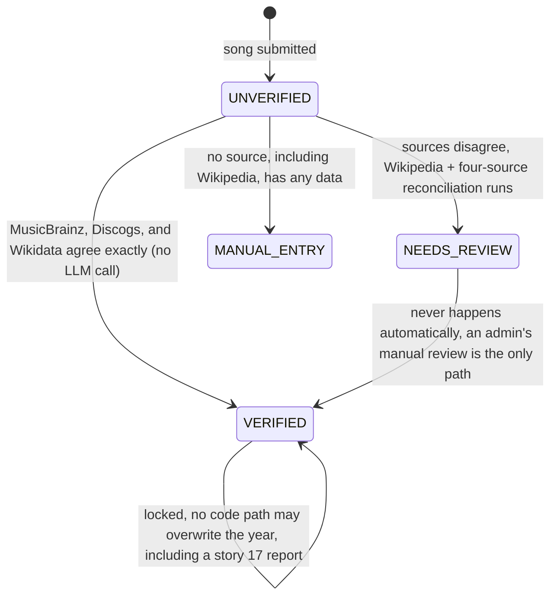
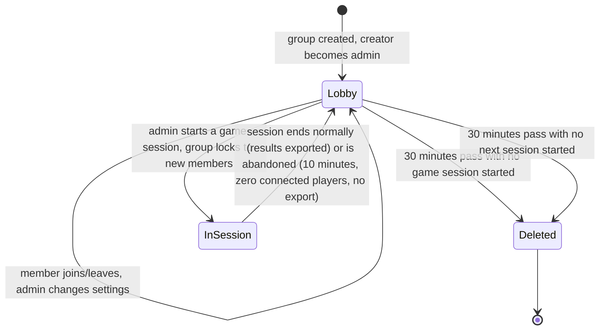
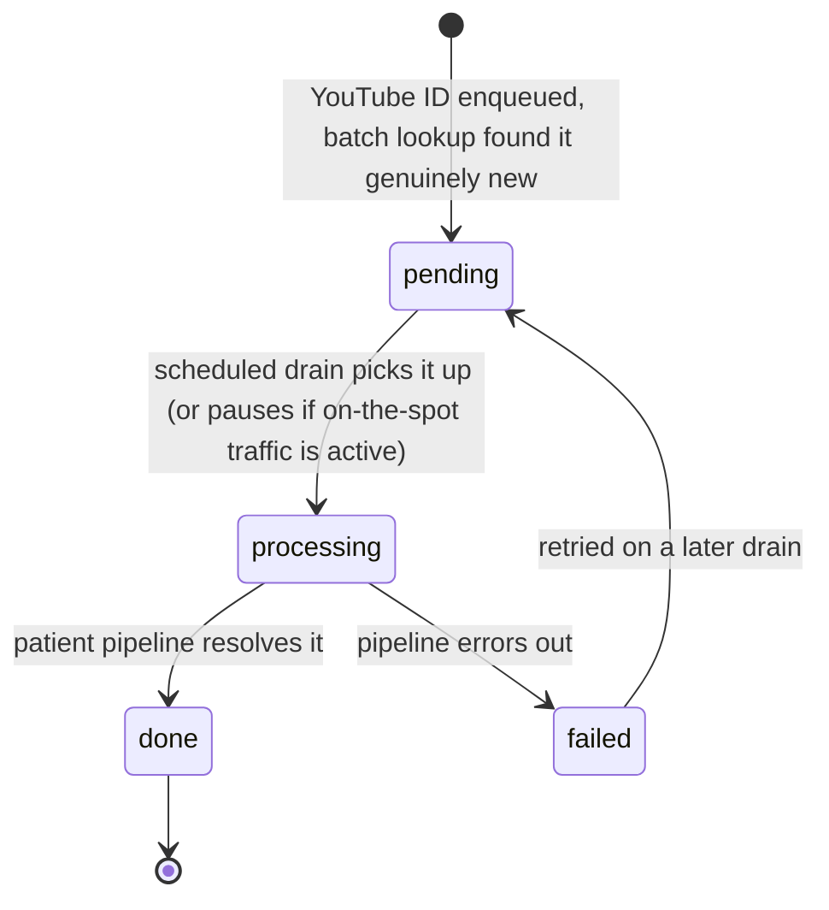

# SYSTEM_REFERENCE.md: API Contracts, Entity Model, State Diagrams

Structured reference for what exists in the code today, distinct from [ARCHITECTURE.md](ARCHITECTURE.md)'s narrative blueprint of the target shape. Where a section describes something not yet built, it says so explicitly rather than blending planned and current state together. Regenerate the "current" sections by hand when the underlying code changes; nothing here is auto-generated.

## API contracts

### Core service (Spring Boot)

| Method | Path | Controller |
|---|---|---|
| POST | `/auth/register` | `AuthController` |
| POST | `/auth/login` | `AuthController` |
| POST | `/auth/refresh` | `AuthController` |
| POST | `/auth/logout` | `AuthController` |
| GET | `/api/enums/tags` | `EnumController` |
| GET | `/api/enums/countries` | `EnumController` |
| GET | `/api/playlists/{playlistId}/export/info` | `ExportController` |
| GET | `/api/playlists/{playlistId}/export/qr` | `ExportController` |
| GET | `/api/playlists/{playlistId}` | `PlaylistController` |
| PATCH | `/api/playlists/{playlistId}` | `PlaylistController` |
| GET | `/api/playlists/{playlistId}/songs/{songId}` | `PlaylistController` |
| POST | `/api/playlists/{playlistId}/songs` | `PlaylistController` |
| PATCH | `/api/playlists/{playlistId}/songs/{songId}` | `PlaylistController` |
| DELETE | `/api/playlists/{playlistId}/songs/{songId}` | `PlaylistController` |
| GET | `/api/metadata/song` | `SongMetadataController`, one-in-flight-request-per-user limit, see story 27 |
| GET | `/api/users/me` | `UserController` |
| GET | `/api/users/{userId}` | `UserController` |
| PATCH | `/api/users/me` | `UserController` |
| DELETE | `/api/users/me` | `UserController`, has the real bugs logged in `TASKS.md`'s Bug fixes section |
| POST | `/api/users/me/playlists` | `UserController` |
| GET | `/api/users/me/playlists` | `UserController` |
| POST | `/api/users/me/playlists/{playlistInviteCode}` | `UserController` |
| DELETE | `/api/users/me/playlists/{playlistId}` | `UserController` |

### AI microservice (FastAPI)

| Method | Path | Notes |
|---|---|---|
| POST | `/metadata/resolve` | Internal only, gated by `X-Internal-Api-Key`, called by the core service's `SongMetadataService`, never exposed publicly |

Every endpoint stories 9-13, 17, 30, 39-41 add (group, game session, WebSocket destinations, reports, admin backlog, bulk import) doesn't exist yet, see those stories in `TASKS.md` for the planned shape. This table only lists what's live today.

## Entity model

### Current (JPA entities, core service)

Five entities exist today: `User`, `Playlist`, `Song`, `SongArtist`, `RefreshToken`.

```
User
  ├── id, username, email, password, imageUrl
  ├── authProvider, authProviderId
  ├── role (USER only today, see story 40 for ADMIN and story 44 for TEST)
  └── playlists: Set<Playlist>  (@ManyToMany, EAGER)

Playlist
  ├── id, name, color, inviteCode (unique, immutable)
  ├── songs: List<Song>  (@ManyToMany, owning side, joins through song_playlists; removing a song here
  │     only ever unlinks it, a Song is never deleted as a side effect of playlist membership)
  └── users: Set<User>   (@ManyToMany, mappedBy "playlists")

Song
  ├── id, title, releaseYear, youtubeId, gradientColor1, gradientColor2
  ├── artists: List<SongArtist>  (@OneToMany, ordered by displayOrder; today always one MAIN entry,
  │     the submission flow has no multi-artist entry UI yet, see story 40's featured-artist extraction)
  ├── tags: Set<SongTag>  (PLAYLIST/SPECIAL/ANIME; empty means no tags, story 30 needs genre/popularity
  │     fields story 23 didn't cover)
  ├── country
  ├── verificationStatus (UNVERIFIED default, VERIFIED, NEEDS_REVIEW, MANUAL_ENTRY; see the state
  │     diagram below, story 18 still owns the actual lock-evaluation logic that moves it)
  ├── confidence, metadataRaw (populated once story 18's pipeline actually runs; both nullable today)
  ├── playlists: Set<Playlist>  (@ManyToMany, mappedBy "songs"; a song can belong to more than one
  │     playlist since story 15, and to zero, a song is a standalone catalog entity independent of
  │     any playlist, see DECISIONS.md's 2026-09 "Song deletion reversed" entry)
  └── addedBy: User       (@ManyToOne, no inverse mapping, no cascade, the DELETE /me bug in TASKS.md's Bug fixes)

SongArtist
  ├── id, name, role (MAIN/FEATURED), displayOrder
  └── song: Song  (@ManyToOne, owns the FK back to Song)

RefreshToken
  ├── id, token (unique, hashed)
  ├── user: User  (@OneToOne)
  └── expiresAt
```

Schema changes now go through Flyway migrations (`backend/src/main/resources/db/migration/`), not Hibernate's `ddl-auto` (moved to `validate`); `spring-boot-flyway` is a required dependency alongside the third-party `flyway-core`/`flyway-database-postgresql` libraries for Spring Boot's own autoconfiguration to actually run it.

### Planned (not yet code, target shape per ARCHITECTURE.md and TASKS.md)

Listed here so the entity picture is in one place; each is still greenfield work under its own story.

- `Group`, `Member` (story 39)
- `GameSession`, `Player`, `Round`, `Guess` (story 10)
- `ChatMessage` (story 13)
- `SongReport`, `SongConfirmation` (story 17)
- `PendingImport`, an alternate-YouTube-ID-to-`Song` mapping table (story 40)
- `SongDifficulty` aggregate view or table (story 30)
- `TEST`/`ADMIN` values on `User.role` (stories 44 and 40)

## State diagrams

### Song verification status (stories 18, 23)



`VERIFIED` is a lock, not just a status: once set, nothing (including a community report) changes the year without going through the same manual review process, per the 2026-08/2026-09 `DECISIONS.md` entries. `MANUAL_ENTRY` is the least-trusted tier, distinct from `NEEDS_REVIEW`.

### Group and game session lifecycle (stories 10, 39)



A group can cycle through `Lobby` → `InSession` → `Lobby` any number of times before being deleted. `GameSession` itself is ephemeral within `InSession`: purged entirely once it ends or is abandoned, except for a downloadable results export on a normal end.

### Admin catalog backlog item (story 40)



A `PendingImport` row can also be created indirectly: the on-the-spot fast tier resolves a song provisionally, then re-enqueues it here at low priority so the patient pipeline re-verifies it properly afterward.
