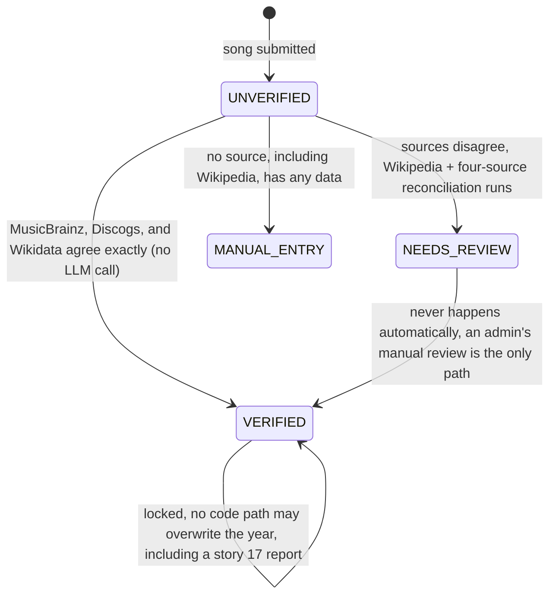
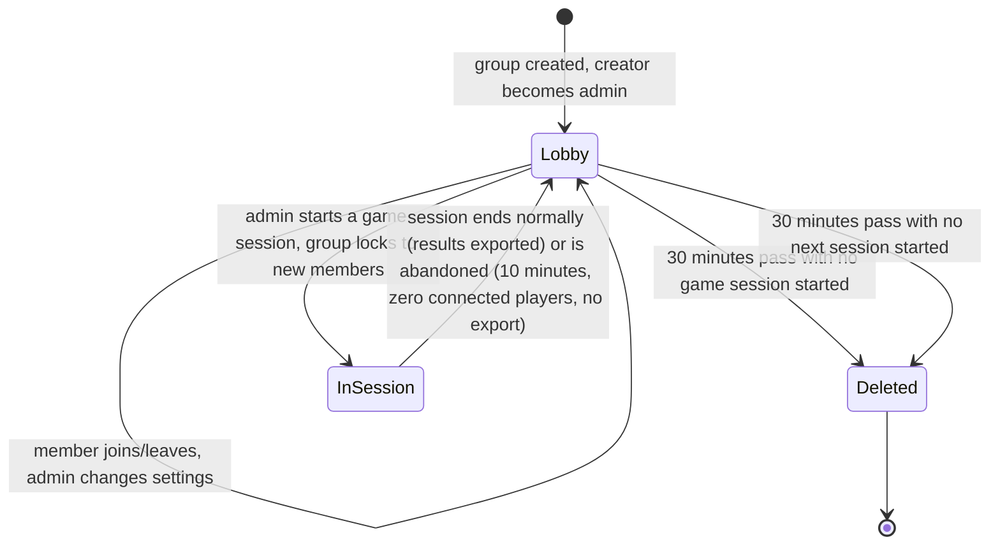
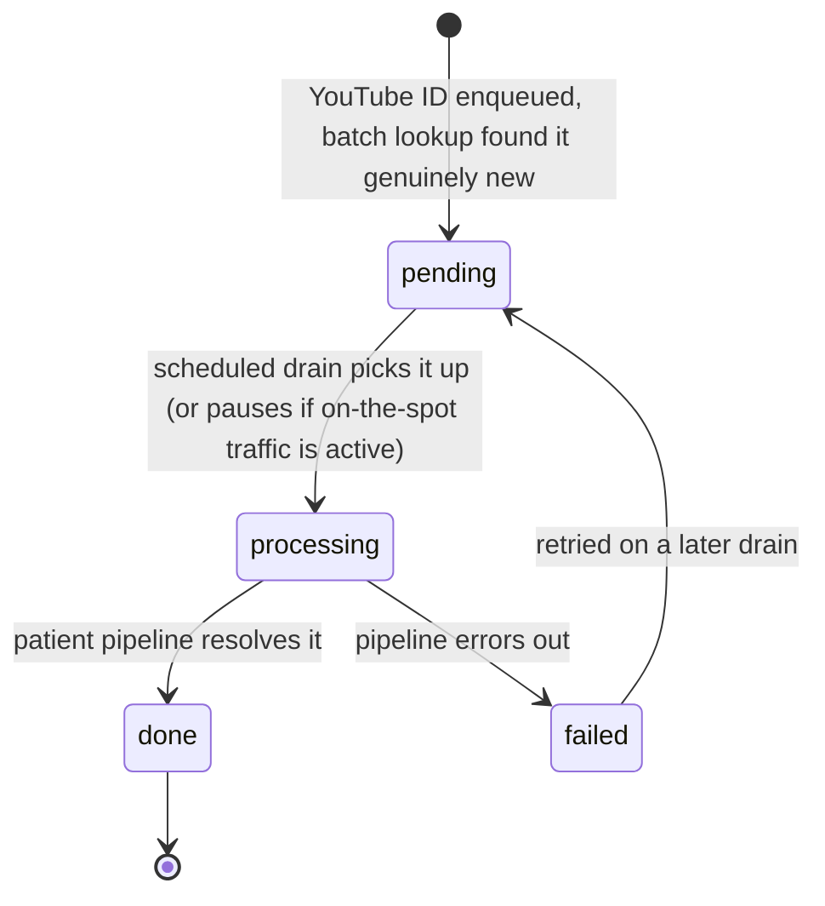

# SYSTEM_REFERENCE.md: API Contracts, Entity Model, State Diagrams

Structured reference for what exists in the code today, distinct from [ARCHITECTURE.md](ARCHITECTURE.md)'s narrative blueprint of the target shape. Where a section describes something not yet built, it says so explicitly rather than blending planned and current state together. Regenerate the "current" sections by hand when the underlying code changes; nothing here is auto-generated.

## API contracts

Every rate-limited request the core service rejects, whichever limiter caught it, returns 429 with the same body every other error response uses: `ErrorResponse` (`status`, `message`, `timestamp`), never Spring's default `ProblemDetail`. `RateLimitingFilter` applies a 60-requests-per-minute limit to every request, keyed by authenticated user where one exists and by client IP otherwise, except `/auth/login` and `/auth/register`, which always share a stricter 5-requests-per-minute bucket keyed by IP regardless of authentication state. See story 27 in `DECISIONS.md`.

### Core service (Spring Boot)

| Method | Path | Controller |
|---|---|---|
| POST | `/auth/register` | `AuthController`, rate-limited, see story 27 |
| POST | `/auth/login` | `AuthController`, rate-limited, see story 27 |
| POST | `/auth/refresh` | `AuthController` |
| POST | `/auth/logout` | `AuthController` |
| GET | `/api/enums/countries` | `EnumController` |
| GET | `/api/playlists/{playlistId}/export/info` | `ExportController`, `paperSize` query param (`A4`/`LETTER`, default `A4`) |
| GET | `/api/playlists/{playlistId}/export/qr` | `ExportController`, same `paperSize` query param |
| GET | `/api/playlists/{playlistId}` | `PlaylistController`, requires `canRead` |
| PATCH | `/api/playlists/{playlistId}` | `PlaylistController`, owner only |
| GET | `/api/playlists/{playlistId}/songs/{songId}` | `PlaylistController`, requires `canRead` |
| POST | `/api/playlists/{playlistId}/songs` | `PlaylistController`, requires `canWrite` |
| PATCH | `/api/playlists/{playlistId}/songs/{songId}` | `PlaylistController`, requires `canWrite` |
| DELETE | `/api/playlists/{playlistId}/songs/{songId}` | `PlaylistController`, requires `canDelete` |
| GET | `/api/playlists/{playlistId}/members` | `PlaylistController`, requires `canRead`, story 46 |
| PATCH | `/api/playlists/{playlistId}/members/{userId}` | `PlaylistController`, owner only, updates a member's grants, story 46 |
| DELETE | `/api/playlists/{playlistId}/members/{userId}` | `PlaylistController`, owner only, kicks a member, story 46 |
| POST | `/api/playlists/{playlistId}/members/{userId}/ban` | `PlaylistController`, owner only, bans a member, story 46 |
| POST | `/api/playlists/{playlistId}/members/{userId}/promote` | `PlaylistController`, owner only, transfers ownership, previous owner stays a member, story 46 |
| GET | `/api/metadata/song` | `SongMetadataController`, one-in-flight-request-per-user limit plus the general time-window rate limit, see story 27 |
| GET | `/api/users/me` | `UserController` |
| GET | `/api/users/{userId}` | `UserController` |
| PATCH | `/api/users/me` | `UserController` |
| DELETE | `/api/users/me` | `UserController`, story 37 fixed the FK violation and playlist-orphaning bugs formerly logged in `TASKS.md`'s Bug fixes section |
| GET | `/api/users/me/export` | `UserController`, `PersonalDataExportService`, GDPR personal-data export: account fields, every playlist membership, every submitted song, story 37, distinct from `ExportController`'s playlist-content PDFs |
| POST | `/api/users/me/playlists` | `UserController` |
| GET | `/api/users/me/playlists` | `UserController` |
| POST | `/api/users/me/playlists/{playlistInviteCode}` | `UserController`, optional body carries a per-playlist display name and avatar, rejects a banned user, story 46 |
| DELETE | `/api/users/me/playlists/{playlistId}` | `UserController`, the owner can leave at any time, leadership passes to the earliest-joined remaining member, story 46 |
| POST | `/api/groups` | `GroupController`, creates a group, the creator becomes its admin, story 39 |
| POST | `/api/groups/join` | `GroupController`, join by invite link, rejects a banned or already-in-a-group user, story 39 |
| GET | `/api/groups/active` | `GroupController`, the caller's current active group, story 39 |
| GET | `/api/groups/{groupId}` | `GroupController`, story 39 |
| PATCH | `/api/groups/{groupId}/settings` | `GroupController`, admin only, story 39 |
| POST | `/api/groups/{groupId}/start-session` | `GroupController`, admin only, locks the group to new members, story 39 |
| POST | `/api/groups/{groupId}/leave` | `GroupController`, an explicit leave, admin leave passes leadership to the earliest-joined member, story 39 |
| POST | `/api/groups/{groupId}/disconnect` | `GroupController`, marks the caller disconnected without ending membership, story 39 |
| POST | `/api/groups/{groupId}/reconnect` | `GroupController`, story 39 |
| POST | `/api/groups/{groupId}/members/{memberId}/promote` | `GroupController`, admin only, promotes another member to admin, story 39 |
| POST | `/api/groups/{groupId}/voice/join` | `GroupController`, sets the caller's `isInVoice` presence flag, story 39 |
| POST | `/api/groups/{groupId}/voice/leave` | `GroupController`, clears the `isInVoice` presence flag, story 39 |
| GET | `/api/sessions/{sessionId}` | `GameSessionController`, story 10 |
| GET | `/api/sessions/groups/{groupId}/results` | `GameSessionController`, a completed session's downloadable results export, story 10 |
| POST | `/api/admin/catalog-seeding/enqueue` | `AdminCatalogSeedingController`, admin only via `AdminAccessGuard`, enqueues submitted YouTube IDs the catalog does not already have, story 40 |
| GET | `/api/admin/catalog-seeding/status` | `AdminCatalogSeedingController`, admin only, the backlog view (pending, done, failed counts), story 40 |
| POST | `/api/bulk-import` | `BulkImportController`, any authenticated user, immediate on-the-spot resolution of a submitted YouTube playlist or ID list, never shares the admin backlog's queue, story 40 |
| GET | `/actuator/health` | Actuator, unauthenticated at the top-level status; component detail gated by `management.endpoint.health.show-details=when-authorized`, story 38 |
| GET | `/actuator/prometheus` | Actuator, Prometheus scrape format via `micrometer-registry-prometheus`, story 38 |

### AI microservice (FastAPI)

| Method | Path | Notes |
|---|---|---|
| POST | `/metadata/resolve` | Internal only, gated by `X-Internal-Api-Key`, called by the core service's `SongMetadataService`, never exposed publicly. Independently rate-limited at 30 requests per minute per client address, evaluated before the internal-key check, since anyone holding that shared key could otherwise call it directly. See story 27 |
| GET | `/health` | Unauthenticated, story 38 |
| GET | `/metrics` | Prometheus scrape format via `prometheus-fastapi-instrumentator`, story 38 |

### Correlation id (story 38)

Both services accept and echo an `X-Request-Id` header on every request: the core service's `CorrelationIdFilter` and the AI microservice's `CorrelationIdMiddleware` reuse an incoming value or generate one, attach it to the active OpenTelemetry span as a `request.id` attribute, include it in every structured log line emitted while handling that request, and echo it back on the response. The core service's `CorrelationIdPropagatingInterceptor` forwards the current request's id onto the outgoing RestClient call to the AI microservice, so one user action stays traceable across both services' logs and correlates with a single trace.

Story 39's group endpoints, story 10's game-session endpoints, and story 40's admin catalog-seeding and bulk-import endpoints are live and listed above. Story 10 and 11 also add STOMP client-to-server destinations for in-session actions, handled by `GameActionController`:

| Destination | Controller | Notes |
|---|---|---|
| `/app/sessions/{sessionId}/place` | `GameActionController` | Lock in a card placement, story 10 |
| `/app/sessions/{sessionId}/guess` | `GameActionController` | Submit a title/artist guess, story 10 |
| `/app/sessions/{sessionId}/bet` | `GameActionController` | Place a bet after the active player's guess locks, story 10 |
| `/app/sessions/{sessionId}/skip-betting` | `GameActionController` | Skip the betting window, story 10 |

The endpoints stories 9, 12, 13, 17, and 30 add (DJ link-out, voice signaling, group text chat, community reports and confirmations, difficulty-tuned generation) do not exist on `dev` yet; story 17's report endpoints are built on `feature/community-reports` (PR #100 open) but not merged. See those stories in `TASKS.md` for the planned shape. This table only lists what's live on `dev` today.

## Entity model

### Current (JPA entities, core service)

Current JPA entities: `User`, `Playlist`, `PlaylistMembership`, `PlaylistBan`, `Song`, `SongArtist`, `RefreshToken`, plus `Group` and `Member` (story 39), `GameSession`, `Player`, `Round`, and `Guess` (story 10), and `AlternateYoutubeId` and `PendingImport` (story 40). The core seven are detailed below; the game and group entities follow the shapes in `ARCHITECTURE.md` and their own story sections in `TASKS.md`. `SongReport` and `SongConfirmation` (story 17) exist on `feature/community-reports` but are not merged to `dev` yet (PR #100 open), so they are listed under Planned below.

```
User
  ├── id, username, email, password, imageUrl
  ├── authProvider, authProviderId
  └── role (USER, TEST, ADMIN)

Playlist
  ├── id, name, color, inviteCode (unique, immutable)
  ├── owner: User  (@ManyToOne, set to the creator on creation, story 46; only the owner can rename,
  │     change color, delete the playlist, or manage members)
  ├── songs: List<Song>  (@ManyToMany, owning side, joins through song_playlists; removing a song here
  │     only ever unlinks it, a Song is never deleted as a side effect of playlist membership)
  └── memberships: List<PlaylistMembership>  (@OneToMany, cascade ALL, orphanRemoval, story 46 replaces
        the old plain users many-to-many)

PlaylistMembership
  ├── id, canRead, canWrite, canDelete  (independently revocable, story 46; an owner has all three
  │     implicitly and holds no override here)
  ├── displayName, avatarUrl  (per-playlist identity, defaults to the account's own at join time)
  ├── joinedAt
  ├── playlist: Playlist  (@ManyToOne, owns the FK)
  └── user: User  (@ManyToOne)

PlaylistBan
  ├── id, bannedAt
  ├── playlist: Playlist  (@ManyToOne)
  └── user: User  (@ManyToOne; existence of a row blocks that user's future join-by-invite attempts
        against this playlist, independent of PlaylistMembership, story 46)

Song
  ├── id, title, releaseYear, youtubeId, gradientColor1, gradientColor2
  ├── artists: List<SongArtist>  (@OneToMany, ordered by displayOrder; today always one MAIN entry,
  │     the submission flow has no multi-artist entry UI yet, see story 40's featured-artist extraction)
  ├── genre  (nullable String, populated by the metadata pipeline once it runs, not user-submitted,
  │     same as confidence/metadataRaw below; replaces the old SongTag/PLAYLIST/SPECIAL/ANIME enum,
  │     which had no analog in the settled design mockups, see DECISIONS.md's 2026-09 entry)
  ├── country
  ├── verificationStatus (UNVERIFIED default, VERIFIED, NEEDS_REVIEW, MANUAL_ENTRY; see the state
  │     diagram below; story 18's lock-evaluation pipeline that moves it is built)
  ├── confidence, metadataRaw (populated by story 18's pipeline; both nullable until a song runs through it)
  ├── playlists: Set<Playlist>  (@ManyToMany, mappedBy "songs"; a song can belong to more than one
  │     playlist since story 15, and to zero, a song is a standalone catalog entity independent of
  │     any playlist, see DECISIONS.md's 2026-09 "Song deletion reversed" entry)
  └── addedBy: User       (@ManyToOne, nullable since story 37, no inverse mapping; cleared, not blocked
        or cascaded, when the submitting account is deleted)

SongArtist
  ├── id, name, role (MAIN/FEATURED), displayOrder
  └── song: Song  (@ManyToOne, owns the FK back to Song)

RefreshToken
  ├── id, token (unique, hashed)
  ├── user: User  (@OneToOne)
  └── expiresAt
```

Schema changes now go through Flyway migrations (`backend/src/main/resources/db/migration/`), not Hibernate's `ddl-auto` (moved to `validate`); `spring-boot-flyway` is a required dependency alongside the third-party `flyway-core`/`flyway-database-postgresql` libraries for Spring Boot's own autoconfiguration to actually run it. Migrations on `dev` run through V12 (`V12__add_alternate_youtube_ids_and_pending_imports`, story 40); story 17's `V13__add_song_reports_and_confirmations` lands with PR #100 once it merges.

### Planned (not yet code, target shape per ARCHITECTURE.md and TASKS.md)

Listed here so the entity picture is in one place; each is still greenfield work under its own story.

- `ChatMessage` (story 13)
- `SongDifficulty` aggregate view or table (story 30)
- `SongReport`, `SongConfirmation` (story 17): built on `feature/community-reports`, PR #100 open against `dev`, not merged yet

### Analytics store (story 33)

A separate database from the transactional one above, not JPA-mapped: its own Flyway history under `db/analytics-migration`, its own `DataSource`/`JdbcTemplate` wired in `AnalyticsDataSourceConfig` (`org.dariusturcu.backend.analytics`). One table, `analytics_events`:

```
analytics_events
  ├── id (bigserial)
  ├── event_type (text, matches AnalyticsEventType's enum names)
  ├── occurred_at (timestamptz, defaults to insertion time)
  └── payload (jsonb, one typed record per AnalyticsEventType)
```

`AnalyticsEventType` values: `GAME_SESSION_STARTED`, `GAME_SESSION_ENDED`, `LOGIN`, `PLAYLIST_CREATED`, `SONG_SUBMITTED`, `RATE_LIMIT_EXCEEDED`, `REPORT_SUBMITTED`, `FAILED_LOGIN_ATTEMPT`, each with its own payload record in the same package. `AnalyticsEventRecorder.recordEvent(AnalyticsEventType, Object)` is the write API; nothing calls it yet, story 34 instruments the real event-producing call sites. `AnalyticsRetentionService.purgeExpiredEvents()`, swept daily by `AnalyticsRetentionSweeper`, deletes events older than `analytics.retention.days` (180 by default).

## State diagrams

### Song verification status (stories 18, 23)



`VERIFIED` is a lock, not just a status: once set, nothing (including a community report) changes the year without going through the same manual review process, per the 2026-08/2026-09 `DECISIONS.md` entries. `MANUAL_ENTRY` is the least-trusted tier, distinct from `NEEDS_REVIEW`.

### Group and game session lifecycle (stories 10, 39)



A group can cycle through `Lobby` → `InSession` → `Lobby` any number of times before being deleted. `GameSession` itself is ephemeral within `InSession`: purged entirely once it ends or is abandoned, except for a downloadable results export on a normal end.

### Admin catalog backlog item (story 40)



A `PendingImport` row can also be created indirectly: the on-the-spot fast tier resolves a song provisionally, then re-enqueues it here at low priority so the patient pipeline re-verifies it properly afterward.
